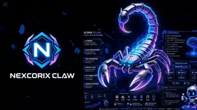

<div align="center">


# 🦂 NEXCORIX CLAW

### Next-Generation AI Agent Framework


</div>

## 🎬 Demo

<p align="center">

</p>

## 🌌 Gambaran Umum

Nexcorix Claw adalah framework AI Agent modern yang dirancang untuk membangun agen cerdas, sistem memori, integrasi MCP, otomatisasi workflow, dan ekosistem plugin yang fleksibel.

## ✨ Fitur

### 🤖 Sistem Multi-Agen

- Agen Otonom
- Perencanaan Tugas
- Eksekusi Alur Kerja
- Kolaborasi Agen
- Perutean Dinamis

### 🧠 Memori Permanen

- Memori Jangka Panjang
- Pencarian Semantik
- Pengambilan Konteks
- Penyimpanan Pengetahuan
- Sinkronisasi Memori

### 🔌 Integrasi MCP

- Sistem Berkas
- Browser
- GitHub
- Basis Data
- Server MCP Kustom

### 🛠️ Ekosistem Plugin

- Plugin Kustom
- Sistem Keterampilan
- Integrasi Alat
- API Eksternal

### 🔒 Keamanan

- Runtime Terkotak Pasir
- Kontrol Izin
- Eksekusi Aman
- Isolasi Sesi

### ⚡ Performa

- Runtime Cepat
- Tugas Async
- Efisien
- Skalabel

## 🚀 Quick Start

```bash
git clone https://github.com/johansvaj/Cakar-Nexorix.git

cd Cakar-Nexorix

pip install -r requirements.txt

python main.py
```

## 📦 Instalasi

### Windows

```bash
git clone https://github.com/johansvaj/Cakar-Nexorix.git

cd Cakar-Nexorix

python -m venv venv

venv\Scripts\activate

pip install -r requirements.txt

python main.py
```

### Linux

```bash
git clone https://github.com/johansvaj/Cakar-Nexorix.git

cd Cakar-Nexorix

python3 -m venv venv

source venv/bin/activate

pip install -r requirements.txt

python3 main.py
```

### macOS

```bash
git clone https://github.com/johansvaj/Cakar-Nexorix.git

cd Cakar-Nexorix

python3 -m venv venv

source venv/bin/activate

pip install -r requirements.txt

python3 main.py
```

## 🎯 Penggunaan

Buat Agen

```bash
nexcorix create-agent
```

Jalankan Agen

```bash
nexcorix run --agent coder
```

Tampilkan Semua Agen

```bash
nexcorix list-agents
```

Sinkronisasi Memori

```bash
nexcorix memory sync
```

Cari Memori

```bash
nexcorix memory search "project"
```

## 🧠 Arsitektur

```text
                           ⚡
                           │
                 ┌─────────▼─────────┐
                 │   NEXCORIX CLAW   │
                 └─────────┬─────────┘
                           │

      ┌────────────────────┼────────────────────┐
      │                    │                    │

      ▼                    ▼                    ▼

   🧠 Memory           🤖 Agents            🔌 MCP

      │                    │                    │

 ┌────┴────┐         ┌─────┴─────┐       ┌────┴────┐
 │Vector DB│         │Task Engine│       │Servers  │
 └────┬────┘         └─────┬─────┘       └────┬────┘

      └──────────────┬─────┴─────┬────────────┘
                     ▼           ▼

                 🛠️ Tools    🌐 APIs
```

## 📁 Struktur Proyek

```text
Cakar-Nexorix/
│
├── agents/
├── memory/
├── tools/
├── plugins/
├── docs/
├── logo.png
├── VID-20260609-WA0009.gif
├── requirements.txt
├── main.py
└── README.md
```

## 🌐 Model yang Didukung

- GPT
- Claude
- Gemini
- DeepSeek
- Qwen
- Ollama
- Local Models

## 📈 Roadmap

- [x] Core Runtime
- [x] Multi-Agent
- [x] Memory Engine
- [x] MCP Integration
- [x] Plugin System
- [ ] Visual Workflow Builder
- [ ] Mobile Dashboard
- [ ] Cloud Platform
- [ ] Marketplace

## 🤝 Kontribusi

```bash
fork
↓
code
↓
commit
↓
pull request
```

Kontribusi selalu diterima.

## 📜 Lisensi

MIT License

<div align="center">

# 🦂 NEXCORIX CLAW

### Create • Automate • Innovate

Version 0.4.0

Built For The Future

</div>
